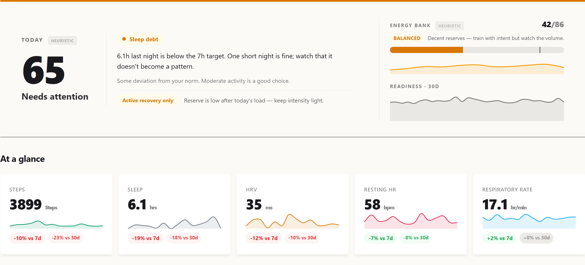

This is Part 1 of a series about building my self-hosted Health Dashboard. The first version was not a methodology project. It was a pipe: take data from Apple Health, POST it to my server, show a score in the morning.

That sounds clean until the first bad night of data lands in Postgres. A health score is only as trustworthy as the ingestion path underneath it, and the early version of this system was mostly teaching me that lesson the hard way.

One of the earliest failure modes looked like this:

```text
insert: insert point heart_rate/2026-04-19 08:47:39 +0200: timeout: context deadline exceeded
POST /health/vitals 32.057s
```

From the phone's point of view, the sync failed. From the server's point of view, it may already have written part of the payload. From the dashboard's point of view, the next readiness number could be based on a half-ingested day. That is the kind of bug that makes a pretty chart actively harmful.

In that first phase I was still committing directly to the project. Pull requests came later, once the system had enough surface area that review and explicit checkpoints were worth the extra ceremony.

## The first real boundary

The architecture that survived is deliberately boring:

```text
POST /health -> InsertRaw -> health_records -> 200 to client
                              |
                              v
                         InsertPoints
                              |
                              v
                    metric_points -> hourly_metrics -> daily_scores
```

The important decision is that `health_records` is the source of truth. The raw JSON payload is saved before parsing, aggregation, scoring, AI summaries, or notifications get involved. Everything downstream is derived and can be rebuilt.

That one boundary changed the system. A failed parser stopped being a data-loss incident. A scoring bug became a cache invalidation problem. A suspicious dashboard value could be traced back to the exact raw payload that produced it.

It also made the API contract clearer. The first durable server responsibility is not "compute readiness". It is "accept the observation without losing it".


*The current dashboard hero, what the pipeline ultimately renders. The score on the left is the readiness number this series spent eight parts trying to make honest.*

## Scores came later

The first readiness score was intentionally simple:

```text
readiness = HRV_score * 0.40 + RHR_score * 0.30 + Sleep_score * 0.30
```

Each component compared recent values against a personal baseline. This was enough to make the dashboard useful, but not enough to make it scientifically strong. It was a heuristic, not a validated forecasting model.

That distinction matters. Wearable products often hide this part behind a confident number. I wanted the opposite: every module should carry its own trust label. Some parts are expert-tuned heuristics. Some are experimental. Some are candidates only if they beat a naive baseline on held-out data.

The score became less interesting than the question around it: what evidence would make me trust this number tomorrow morning?

## Explanations came before AI

The first explanations were not generated by a model. They were rule-based bullets and "How it works" cards: HRV[^hrv], resting heart rate[^rhr], sleep stages, SpO2[^spo2], VO2 max[^vo2max], respiratory rate, activity, and readiness each had explicit text tied back to the scoring rules and literature notes.

That mattered because the system had to be inspectable even with Gemini turned off. AI came later as a second layer: deeper prose under the rule-based sections, then per-block generation for Sleep, Yesterday, Recovery, and Recommendation, cached by input hash so a late HRV sample only invalidated the blocks that depended on it.

The product rule stayed the same: AI can explain and contextualize, but it does not replace the deterministic explanation. If Gemini says something strange, the numeric bullets and method notes are still there to argue with.

## The cache is not the truth

The system reads cache-first because a dashboard cannot scan raw time-series data on every request:

- `metric_points` stores parsed observations.
- `hourly_metrics` aggregates per hour and source.
- `daily_scores` rolls those into sleep, HRV, resting heart rate, activity, oxygen, respiration, and readiness.

But the cache is never allowed to become the truth. After new health data arrives, the server rebuilds the affected dates directly from `metric_points`. A debounced backfill exists as a safety net. A full rebuild can wipe derived tables and recompute them from raw observations.

That sounds like implementation detail, but it is the difference between debugging a health product and debugging a spreadsheet. If the score looks wrong, I need a path back to the observation, the source, the day bucket, and the formula version.

## Cache invalidation became part of the product

The caching story had its own mini-evolution. At first, a rebuild sounded like a big hammer: truncate derived tables and recompute the world. That works when the database is small. It stops being a sane operational move when the production table has 4,695,057 `metric_points` rows and the dashboard has multiple tenants.

The fix was to make cache repair proportional to the change. If a migration only touches a small set of sleep rows, it should rebuild those dates through the same path as a fresh `/health` ingest. That is what the targeted `UpsertRecentCache` path ended up doing for the `sleep_unspecified` migration: rebuild the affected dates through the ingestion path instead of reaching for a full `make backfill --force` run.

There were three separate cache-invalidation problems hiding under one name:

- **Fresh data**: after `POST /health`, rebuild the affected hourly and daily rows immediately, then let the debounced 48-hour backfill catch stragglers.
- **Formula changes**: bump `ScoreVersion` so cached readiness rows are treated as stale after the scoring rules change.
- **Representation changes**: when a metric changes meaning, like splitting coarse sleep into `sleep_unspecified`, update the source rows and rebuild only the dates that can be affected.

A later readiness API bug made the same point in a different layer. The server exposed stable readiness bands for the briefing response, but the iOS sparkline still read `/api/readiness-history` and kept its own thresholds. The fix was not "update the app's constants". The fix was to make the server the single source of truth for band semantics across both endpoints.

That became a recurring rule: if a derived value can outlive the code that produced it, it needs an invalidation story. If two clients can render the same concept, the concept needs one owner.

## Historical data came from Apple Health export

Live ingestion was only half the story. A health system that starts today is not very useful for baselines, trends, or calibration. I needed history.

That is where the Apple Health export importer came in. iOS can export a large `export.zip` with `apple_health_export/export.xml` inside. One representative export I inspected was 149 MB compressed and expanded to a 2.4 GB `export.xml`. The server has a standalone importer, `cmd/import`, plus a web upload flow in Settings. Both use the same `internal/applehealth` parser: a streaming XML decoder that can handle multi-gigabyte `export.xml` files without loading the whole thing into memory.

The "Apple Health Auto Export" path referenced above is a third-party iOS app[^hae] that runs on a schedule and POSTs HealthKit[^healthkit] data to a configurable HTTP endpoint. That is how this server first started receiving data, before any of my own iOS code existed.

The importer maps HealthKit record types into the same internal metric names used by live sync, normalizes Apple's fraction-based percentages into the dashboard's 0-100 scale, writes points in batches, and supports `--dry-run` for parsing without touching the database. The CLI version finishes by rebuilding aggregate caches and scores. The web version tracks progress, runs one import at a time per tenant, and invalidates the imported date range.

The subtle part was conflict resolution. Health Auto Export and Apple Health export can cover the same dates, but they are not equally authoritative. For historical repair, the full Apple Health export became ground truth: when importing an overlapping range, the system removes Auto Export rows for those dates and rebuilds derived caches. That keeps gap-filling from becoming duplicate-filling.

This split became another important boundary: Apple Health export is how I bootstrap or repair history; live sync is how I keep the system current.

## Consumer health data needs reconciliation

The next lesson was that "Apple Health data" is not one dataset. It is a negotiation between Apple Watch, iPhone, RingConn, importers, summaries, fragments, and sometimes stale devices.

Sleep was the clearest example. A total sleep number can look correct while the stage breakdown is wrong. Coarse asleep records can overlap with finer Apple Watch stages. Midnight summaries can duplicate real fragments. One source may emit `sleep_total` with stages, another may emit only an unspecified sleep block.

The fix was not a single clever formula. It became a set of small rules:

- keep `sleep_unspecified` separate from staged sleep;
- prefer Apple Watch over iPhone over other sources when that makes physiological sense;
- deduplicate chart views differently from daily scoring;
- preserve the prior `daily_scores` row instead of letting a malformed single-metric source wipe a staged night.

That last rule is the shape of the whole project: when data quality is ambiguous, prefer explicit uncertainty over confident damage.

## Quality flags before model ambition

Eventually the ingestion layer grew three safety rails:

1. Drop physiologically impossible values before insert.
2. Add a `quality` flag on `metric_points`: `ok`, `impossible`, or `suspect`.
3. Run a soft z-score[^z-score] audit for autonomic metrics against a rolling personal baseline.

In the current production table, of the 4,695,057 rows, 4,695,042 are `ok` and 15 are `suspect`. Examples include `respiratory_rate=34.5` on 2026-05-02 and `heart_rate_variability=186.22012` on 2026-05-10. They are plausible enough that deleting them blindly would be wrong, and unusual enough that feeding them into baselines without scrutiny would also be wrong.

Baseline reads now filter to `quality='ok'`. That forced a readiness cache version bump, because the old cache had been computed under different trust rules.

This is the unglamorous part of building a personal health model. You can spend a week designing a better score, but if a sensor spike or duplicated sleep segment survives into the baseline, the score is just a nicely formatted lie.

## Why I outgrew Health Auto Export

Health Auto Export was the right starting point. It gave me JSON payloads, scheduled exports, and enough coverage to learn what the server needed to become.

But once the server started caring about source identity, sync timing, partial days, sleep edge cases, and cross-checking, a generic exporter became the wrong control plane. That shift is Part 2: moving from "receive whatever Health Auto Export sends" to owning the ingestion layer with a native iOS app.

## The actual lesson

The dashboard started with a score, but the score was not the product. Trust was.

The first useful version was not the one with the best readiness formula. It was the one where I could answer boring questions quickly:

- Did the phone send the data?
- Did the server save the raw payload?
- Which source produced this metric?
- Was this value filtered, flagged, or used in a baseline?
- Can I rebuild the derived tables without losing the original observation?

[^hrv]: Heart rate variability. The millisecond-level fluctuation in intervals between consecutive heartbeats. Counter-intuitively, *more* variability is better: a steady metronome heart suggests sympathetic dominance (stress, illness, fatigue), while a heart that varies its tempo freely indicates parasympathetic recovery. HRV is the canonical autonomic-state marker in modern wearable research.
[^rhr]: Resting heart rate. Heart rate measured during rest, ideally during the last hours of overnight sleep. A drift upward over days is a classic illness or overload signal; downward over weeks signals improving cardiovascular fitness.
[^spo2]: Blood oxygen saturation. The percentage of haemoglobin carrying oxygen, measured optically through the skin. Healthy resting values sit in the 95–100% range; sustained drops below 92% during sleep can indicate sleep apnea or respiratory issues.
[^vo2max]: Maximum rate of oxygen consumption during peak exercise, in mL/(kg·min). Apple Watch estimates it from heart-rate trajectories during walking and running rather than directly measuring it. Strong correlate of cardiovascular fitness and all-cause mortality risk in longitudinal studies.
[^z-score]: Number of standard deviations a value sits from a baseline mean. A z-score of 2 means "twice as far from the average as a typical day's variation." Lets the system compare deviations across metrics with very different units (a +2σ HRV deviation and a +2σ RHR deviation are equally surprising even though the bpm and ms scales are unrelated).
[^hae]: Health Auto Export. A third-party iOS app (not built by me) that periodically reads HealthKit data and POSTs it as JSON to a user-configured HTTP endpoint. The earliest ingestion path for this project; Part 2 covers why and how a native iOS client was added alongside it.
[^healthkit]: Apple's framework for storing and querying health and fitness data on iOS. All sensor readings from Apple Watch, third-party sleep trackers like RingConn, and manual entries flow through HealthKit on the device before any export reaches a server.
