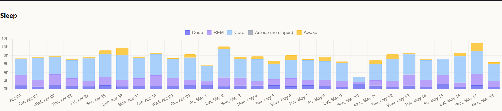

After Part 2 the ingestion layer feels clean. The server accepts payloads, a native iOS client cooperates with Health Auto Export, the schema knows about per-segment sleep, the dashboard renders five sleep phases. It looks finished. It is not.

The next class of problem only became visible once the data was technically correct. On any given night I have **three devices** capable of saying something about my sleep: Apple Watch on my wrist, RingConn[^ringconn] on my finger, and the iPhone next to my bed running Apple's own Sleep Schedule estimate. Each one knows something the others do not. None of them agree about what they measured.

This part is about reconciliation: the small set of rules that decide which source the system believes per night, and why a column with a perfectly reasonable name was lying for years before anyone noticed.

## The three sources, in short

Each device answers a slightly different question with a slightly different vocabulary:

| Device | What it reports for sleep | What it does not |
|---|---|---|
| Apple Watch S7+ | per-segment stages: deep, REM, core, awake | wakes up if not worn; misses naps under ~15 min |
| RingConn | total asleep time + a few summary fields | no stage breakdown; reports a daily summary at midnight |
| iPhone (Sleep Schedule) | estimated bedtime / wake-time windows | no actual sensor data; just inference from screen / motion |

Heart rate is similar. Apple Watch and RingConn both sample HR throughout the day, but with different cadence and different post-processing. HRV[^hrv] is the worst case: Apple measures it event-triggered (Breathe sessions, after exercise, occasional nocturnal); RingConn computes it continuously during sleep using its own RMSSD[^rmssd] methodology. The two are not the same number with measurement error. They are different physiological summaries.

The problem is not that any of these is wrong. The problem is that the database has columns named `sleep_core`, `sleep_total`, `hrv_avg`, and those columns silently mix outputs from devices that mean different things by the same word.

## The column that was lying

Pre-v2.3, the iOS sleep mapping in `health-sync` was three HealthKit values into one wire name:

```swift
case .asleepCore, .asleepUnspecified, .asleep:  return "sleep_core"
```

That looks innocent. On Apple Watch with stage tracking it sends real "core sleep" minutes (Apple's heuristic for light non-REM sleep). On RingConn it sends a coarse "just asleep" span with no stage information at all. On older Apple Watch firmware that never learned stages, same thing. **All three landed in the same `sleep_core` column.**

The dashboard's stages-stacked chart rendered them all as "Core". The daily aggregator summed them into `daily_scores.sleep_core_hours`. The readiness score (the one Part 1 was about) read that aggregate as input to sleep efficiency. For sources without stage tracking, this said something like "you had 7.5 hours of core sleep", a sentence that does not correspond to any measurement that ever happened. The source said *asleep*, full stop. The system invented a stage.

This is what "lying by omission" means in practice. The data was technically present and technically correct given what was measured. The lie was in the column header: `sleep_core` had two meanings depending on which device wrote the row, and neither the schema nor the chart had any way to say which one was in effect.

The fix was structurally small and methodologically large: introduce a fifth phase metric, `sleep_unspecified`, and require the iOS client to inspect the HealthKit session before emitting. The mapping became:

```swift
case .asleepCore:                          return "sleep_core"          // stages present, real measurement
case .asleepUnspecified, .asleep:          return "sleep_unspecified"   // coarse "just asleep", no stages
```

After the rollout (Part 2 covers the wire-contract and migration), RingConn-only and iPhone-only nights stopped landing in `sleep_core` and started landing in `sleep_unspecified`. The dashboard grew a fifth stages band between REM and awake with the tooltip "No per-stage breakdown from this source". The reader can now see when a night was stage-measured and when it was just clocked.


*The 5-band stages chart after the sleep_unspecified rollout. The grey-blue band between REM and awake is the "no stage breakdown from this source" category that used to silently land in 'core'.*

## The five parallel SQL copies that drifted

Once two sources can describe the same night, the server needs a rule for which one to believe per metric. The first version of that rule was a SQL fragment embedded inline in the query that produced `daily_scores`. The second callsite copied it. The third copied the second. By PR #10 there were **five parallel copies** of the sleep cross-validation SQL, each living next to its own query.

They started identical and drifted apart over the next month. Each PR that touched a sleep edge case fixed *one* copy. The other four kept the old logic. A particular night could pass through different rules depending on which read path the query came from: the daily aggregate, the chart, the briefing payload, the per-source breakdown, the export.

The reconciliation rule itself is not complicated. Prefer Apple Watch over RingConn, take the source with more granular stages, but require a minimum sleep total before trusting a single-source pick. The exact rule, in the form that survived after deduplication into a single helper `sleepCrossValidationPickExpr`:

> If two sources both reported sleep for the same night and their totals diverge by more than 1.4×, take the **minimum** (the longer one is probably double-counting). If neither did, prefer Apple Watch when its total exceeds 1 hour (filters out spurious half-hour blips); otherwise fall back to RingConn.

The minimum-take-when-divergent rule sounds backwards until you see what it catches. RingConn occasionally emits a 0.x-hour "asleep" daily summary at midnight (a stub from its sync rather than a measurement). Without the 1-hour gate, that stub plus an Apple Watch 7-hour night would satisfy "MAX > MIN × 1.4" and the dashboard would proudly display the 0.x-hour number as the night's sleep. The 1-hour floor was added after exactly that bug shipped to production.

There are now three callsites for the rule:

- `sleepCrossValidationPickExpr(valCol)`: value-twin, used by read paths (`metricDataDayFromHourly`, `metricDataRaw`, `briefing.go::fetch`)
- `sleepCrossValidationPickSourceExpr(table, valCol)`: source-twin, used by `upsertDailyForDate` to pick ONE source per night so all five sleep_* stages come from the same device
- `buildDailySleepBlock`: multi-day backfill version, inlined because the GROUP BY shape does not fit the helper's flat-table assumption

The thresholds (1.0h floor, 1.4× divergence) and source priority constants are documented as load-bearing in a comment inside `buildDailySleepBlock`. Any change has to land in all three places. The deduplication was the fix. The earlier drift was the lesson.

## The all-or-nothing gate

The source pick is necessary but not sufficient. Once you pick a source per night, you have to commit to its full stage breakdown. Otherwise you end up with a row where `sleep_deep` comes from Apple Watch and `sleep_core` comes from RingConn, and the totals do not add up to anything that ever happened.

`upsertDailyForDate` enforces this with a `sleep_picked_complete` gate: the picked source must contribute all five sleep_* metrics (or, for coarse sources, `sleep_total + sleep_unspecified`), or the row is preserved at its previous state. Either an atomic update or none.

The gate has a second branch for coarse-only sources. Without it, a multi-source night where the MIN-pick lands on a device that only reports `sleep_unspecified` would fall through to NULL writes, and the previous staged night would survive as the "truth": wrong but invisible. Both branches are kept in lockstep between `upsertDailyForDate` and `buildDailySleepBlock`.

There is a known case where this is intentionally conservative. If a future source ever emits **only** `sleep_total` (no stages, no `sleep_unspecified`), the gate fails and the previous `daily_scores` row is preserved. The new source's contribution is silently dropped for that night. This is by design: accepting a single-metric pick would let a malformed third-party importer wipe a real staged night by writing only `sleep_total`. Natively-imported data cannot reach this corner; the v2.3 iOS client always pairs `sleep_total` with `sleep_unspecified` for coarse sources, and the Apple Health XML importer maps both `AsleepUnspecified` and bare `Asleep` to `sleep_unspecified`. If a future source forces this case, the fix is to update the upstream emitter, not to loosen the gate.

## Three quality layers around all of this

Source picking handles "which device to believe". The other half of reconciliation is "what to do with values that no device should have measured." That is the quality validation pipeline, with three layers running independently of which source produced the row:

```text
Layer 1 (ingest):   filterImpossible drops out-of-range values
Layer 2 (schema):   quality column flags 'ok' / 'impossible' / 'suspect'
Layer 3 (daily):    z-score sweep marks autonomic outliers as 'suspect'
```

**Layer 1**, hard-impossible drop on ingest. `internal/health/quality.go` defines per-metric physiological ranges: HRV 4–300ms, RHR[^rhr] 28–150 bpm, SpO2[^spo2] 70–100%, wrist temperature within ±5°C of baseline, and so on. `internal/handler/health.go::filterImpossible` drops out-of-range points before insert with rate-limited logging. Metrics without a configured range pass through unvalidated. This is the cheapest gate and catches the loudest sensor failures, the kind that would otherwise crash a chart.

**Layer 2**, the `quality` column on `metric_points`. `TEXT NOT NULL DEFAULT 'ok'`. Values: `ok`, `impossible`, `suspect`. A partial index covers the hot path `WHERE quality='ok'`. Baseline reads filter to `ok` so anomalies do not poison the rolling baseline that anomaly detection itself depends on. The `ScoreVersion` was bumped when this filter was wired in, because the old cached `daily_scores` had been computed under different trust rules.

**Layer 3**, the soft z-score[^z-score] sweep. `internal/storage/quality_audit.go::MarkSuspectPoints` runs a per-metric z-score against a 30-day rolling personal baseline. Values above 3σ get flagged `suspect`. Crucially, **only autonomic metrics participate**: HRV, RHR, SpO2, respiratory rate, wrist temperature, VO2[^vo2max], body mass. Behavioural metrics (steps, calories, exercise minutes) are excluded explicitly. Their bimodal rest/active distribution would make z-scores noisy and would flag every weekend hike as anomalous.

The Layer 3 sweep runs nightly per tenant at 03:00 local. In the current production table that is 15 rows out of 4.7M flagged as `suspect` over the project's history. Examples: `respiratory_rate=34.5` on 2026-05-02, `heart_rate_variability=186.22012` on 2026-05-10. Each one is plausible enough not to be deleted blindly, unusual enough not to feed baselines without scrutiny.

## A short list of rules that survived

A handful of reconciliation rules emerged across the iterations, and these are the ones that actually load-bear in the current system. Each one exists because removing it produced a specific bug:

- Keep `sleep_unspecified` separate from staged sleep. (Removing this is the original lie from a few sections up.)
- Prefer Apple Watch over iPhone over other sources when both are present and the physiology supports it. (Removing this lets RingConn's midnight summary stub win on multi-source nights.)
- Deduplicate chart views differently from daily scoring. (Charts can show overlapping ranges from multiple sources; the daily score must commit to one to avoid double-counting.)
- Preserve the prior `daily_scores` row instead of letting a malformed single-metric source wipe a staged night. (The all-or-nothing gate above.)
- Run the soft z-score sweep on autonomic metrics only. (Including behavioural metrics produced a "weekend warrior" anomaly cluster that flagged half the user's hikes.)
- Filter baseline reads to `quality='ok'`. (Without this, an `impossible` value flagged in Layer 1 can still feed the baseline that Layer 3 uses to detect anomalies.)

That is the shape of the whole "lying by omission" problem. None of the individual rules is clever. The clever part (the part that took multiple regressions to learn) is that reconciliation has to be **explicit and one place**. Five parallel SQL copies do not stay consistent. A schema column with two meanings does not stay honest. A z-score sweep that does not know the difference between autonomic and behavioural metrics will quietly hide one signal under another.

## The actual lesson

Consumer health data is not a dataset. It is a negotiation between devices that disagree about what they measured. Sometimes they disagree because the sensors are different. Sometimes they disagree because the firmware was different at the time of measurement. Sometimes they disagree because one device was on the charger and another invented a daily summary at midnight. The system's job is not to "merge" sources. The system's job is to **decide which one to believe per night, by an explicit rule, and admit when that rule produces no answer**.

The previous article was about trusting the columns: the metric names line up with what the storage layer thinks they mean. This one is about trusting the **source** behind every column on every night. Same data, three devices, one rule per metric, and a quality column that flags the rest.

The next article picks up what becomes possible once reconciliation is solid. With one source per night and explicit ineligibility for the days that cannot be reconciled, you can finally ask: is this score forecastable? Or were we just describing yesterday and calling it tomorrow?

[^ringconn]: A smart ring (China, 2023+) that measures HR, HRV, blood-oxygen, skin temperature, and sleep stages continuously. Cheaper and battery-friendlier than Apple Watch, but with its own measurement methodology that does not always agree with Apple's. Exports data through Apple HealthKit, which is how it ends up in the same pipeline as Apple Watch readings.
[^hrv]: Heart rate variability. The millisecond-level fluctuation in intervals between consecutive heartbeats. Counter-intuitively, *more* variability is better: a steady metronome heart suggests sympathetic dominance (stress, illness, fatigue), while a heart that varies its tempo freely indicates parasympathetic recovery.
[^rmssd]: Root mean square of successive differences. A time-domain HRV metric: take consecutive R-R intervals (beat-to-beat times), compute their differences, square them, average, and take the square root. Stable on short recordings (5 minutes is sufficient) and the consumer-wearable standard. RingConn uses RMSSD; Apple Watch reports the closely-related SDNN.
[^rhr]: Resting heart rate. Heart rate measured during rest, ideally during the last hours of overnight sleep. A drift upward over days is a classic illness or overload signal.
[^spo2]: Blood oxygen saturation. Percentage of haemoglobin carrying oxygen, measured optically through the skin. Healthy resting values sit in the 95–100% range.
[^vo2max]: Maximum rate of oxygen consumption during peak exercise. Apple Watch estimates it from heart-rate trajectories during walking and running rather than directly measuring it.
[^z-score]: Number of standard deviations a value sits from a baseline mean. A z-score of 2 means "twice as far from the average as a typical day's variation." The 3σ cutoff in Layer 3 corresponds to the values lying further from the baseline than 99.7% of historical observations.
