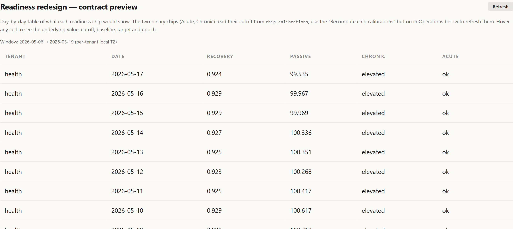

In Part 1 I described the original readiness score:

```text
readiness = HRV_score * 0.40 + RHR_score * 0.30 + Sleep_score * 0.30
```

It was a useful number. It told me, every morning, whether something in last night's data looked unusual against my personal baseline. It also turned out to be measuring the wrong thing.

This part is the audit that surfaced that, the redesign that came out of it, and the moment Phase 1 closed without producing a single model that beat its naive baseline by the criterion we had set in advance.

## The empirical fact that started the redesign

I ran the original score against future physiology on the full historical dataset. The window: `2021-01-01 → 2026-05-15`, 1961 days. Specifically: pair today's `readiness` with tomorrow's measured HRV, RHR and sleep efficiency, and ask whether the score has any forecasting power.

It does not. Today's readiness has essentially zero correlation with tomorrow's HRV, RHR or sleep. Same-day internal consistency is fine (the components agree with each other) but forward predictive power is not there. The score works as a *current-state descriptor*, not as a *forecast of readiness for load*.

This is not a bug. The formula is methodologically misnamed. The redesign addresses that gap, not the weights.

A parallel finding came out of the same audit, this one about EnergyBank v1 (the topic of Part 5): on 387 paired days it was **wrong-signed** against next-day HRV (r=−0.149) and next-day RHR (r=+0.212). Wrong-signed means the concept is intact but its target is mis-specified. Probably what v1 actually captured was productive strain, not recovery deficit. Part 5 picks that up.

## What the data could actually support

Once I stopped asking "how do I improve the score" and started asking "what is this data forecastable for", the constraints tightened a lot.

Daily AR(1)[^ar1] on the candidate targets is low: 0.07–0.28 depending on metric. On a 3-day rolling window the same metrics rise to 0.50–0.58. That difference is not cosmetic smoothing. It is where predictability begins. Below ~0.5 AR(1), most of the variance is measurement noise and a model is mostly memorising sensor jitter.

The intersection of HRV + sleep + walking_hr available on the same day is **889 days, 45% of the calendar.** That is the core training pool. The audit also surfaced anomalies that needed explicit handling:

- **2024 ingest gap.** `walking_heart_rate_average` is missing for the entire year. So is HRV. RHR is partially present. Same root cause: a Health Auto Export config change I never spotted at the time. This is now codified as its own `source_epoch` so models do not treat the gap as physiology.
- **2021 sleep was coarse-only.** 322 daily Recovery rows in 2021 and early 2022 are ineligible for sleep efficiency targets because the data came from RingConn / iPhone Sleep Schedule without stage tracking (Parts 2 and 3 territory). The writer correctly distinguishes these from real out-of-range nights.
- **`minute_metrics` does not store `walking_speed`.** The minute-level walking segment path is closed; the project uses Apple's daily `walking_heart_rate_average` aggregate instead.

The audit also discovered that **Apple Health XML import does not parse `<Workout>` elements.** A representative `export.zip` (149 MB compressed, 2.4 GB uncompressed) contained 800 structured workouts spanning 2019–2026. The database had 11. The 102 entries from the iOS app's live workout endpoint were the only structured workout data ever ingested. Workout-residual readiness (the "real athletic readiness" channel) has no production data to compute against. The sub-score's writer is allocated and emits `eligible=false, reason='importer_gap'` until the import code learns to parse `<Workout>`.

## From "readiness-first" to "recovery-first"

The audit invalidated the original framing. On this dataset the project cannot be a *readiness* system: the structured-workout ground truth that readiness needs is not there. What the data does support, with measurable signal, is **daily recovery + passive efficiency**.

The new shape is five sub-scores in three layers:

```
Core daily layer:
  1. Recovery Stability      → 3d-rolling sleep_efficiency
  2. Passive Efficiency      → 3d-rolling walking_heart_rate_average

Risk layer (parallel signals, different time horizons):
  3. Acute Risk              → HRV/RHR/sleep tail events, t+1..t+3
  4. Chronic Load            → sustained deterioration in Recovery Stability

Optional athletic layer (dormant):
  5. Performance Readiness   → walking workout HR residual
```

Two architectural choices that came with this shape and stuck:

**No aggregate readiness number.** Each sub-score answers a different physiological question. Collapsing them into a weighted average would re-introduce the exact failure mode the redesign exists to escape: a single score with no defined target. The UI presents dimensions and a rule-based decision layer instead.

**Targets are 3-day rolling values or event-window probabilities, not single-day points.** Daily AR(1) is below the noise floor for the metrics I have. The 3-day rolling window is the layer where models could in principle improve over a smoothed naive.

## Phase 0: storage and eligibility

Before any model could be trained, the writers needed to land and produce honest labels for the entire history. Three new tables were added: `target_snapshots`, `feature_snapshots`, `naive_baselines`. A fourth, `source_epochs`, holds the catalogue of ingest/method boundaries at which baselines should reset.

Every target write carries:

- `target_value` (NULL if ineligible)
- `eligible` (bool)
- `eligibility_reason`, an enum: `ok`, `sleep_data_missing`, `coarse_only_source`, `no_walking_hr`, `baseline_warmup`, `event_window_data_missing`, …
- `data_coverage` JSONB with the per-source coverage that drove the decision
- `source_epoch` (`initial`, `source_2024_gap`, `source_2025_current`, …)

`unknown` is a legitimate output. Missing-data days are not imputed. Imputation systematically biases evaluation precisely on the days that matter: travel, illness, watch off. A model that gets graded on imputed labels is a model with a comfortable test set that does not look like reality.

After a full-history pass the numbers look like this:

| Sub-score | target_kind | eligible (`ok`) | ineligible (top reason) |
|---|---|---|---|
| Recovery Stability | rolling_3d | 650 | sleep_data_missing 896 |
| Passive Efficiency | rolling_3d | 891 | no_walking_hr 1070 |
| Acute Risk | event_t1_t3 | 1482 (27.5% positive) | baseline_warmup 337 |
| Acute Risk | event_strict_t1_t3 | 1482 (2.3% positive) | baseline_warmup 337 |
| Chronic Load | chronic_label | 469 (17.5% positive) | baseline_warmup 1191 |
| Chronic Load | chronic_acute_density | 386 (**76.4% positive**) | baseline_warmup 1191 |

Two things to note before any modelling. First, `baseline_warmup` dominates Chronic Load because it needs ≥30 eligible rolling-3d Recovery rows in the current source epoch; the 2024 gap wiped out most of 2024 and bled into Q1-2025. Second, `chronic_acute_density` at 76.4% positive is mis-tuned by construction. The threshold of ≥3 acute OR-events in a 14-day window is below the expected event count given the 27.5% OR base rate (14 × 0.275 = 3.85). Phase 1 retuned this to a higher threshold before any model touched it.

## Phase 1: floors first, then models

The thing I wanted to avoid was the standard ML pattern of "train a model, beat 50% accuracy, declare victory". Without a non-trivial baseline, almost any classifier looks good on autocorrelated time-series data.

So Phase 1 started with naive baselines. They are computed and stored as their own rows in `naive_baselines`. Four candidates for continuous targets: `persistence_yesterday`, `rolling_7d_mean`, `rolling_30d_mean`, `ewma_45d`. One for classifiers: `event_base_rate` (the 90-day rolling prior probability).

The success criterion was set before any model ran:

- **Continuous targets.** Model MAE[^mae] on the primary chronological 70/30 test[^chronological-split] must beat the **lower CI bound** of the best naive baseline, with 1000-iteration block bootstrap[^block-bootstrap] on 14-day blocks (preserves autocorrelation). Beating the point estimate is not enough. That is statistical noise.
- **Classifier targets.** Model precision@recall=0.5[^precision-at-recall] **lower CI** must exceed floor precision@recall=0.5 **upper CI.** The intervals must not overlap. Stratified bootstrap[^stratified-bootstrap] (positives and negatives resampled separately) to preserve class counts on sparse labels.

One subtlety took a while to see. `persistence_yesterday` scored extraordinarily well on every classifier label: precision 0.785–0.947, AUC 0.829–0.979. That looks like a strong floor. It is not. The labels are forward-window: `event_t1_t3` for date `t` covers `t+1..t+3`; for date `t+1` covers `t+2..t+4`. Two of three days are shared between adjacent labels. Persistence is exploiting label-window overlap, not predicting unseen physiology. `chronic_label` looks 14 days forward; adjacent labels share 13 of 14 days, so persistence trivially carries.

The honest classifier floor is `event_base_rate`. Persistence stays in the report for transparency but is not the decision metric.

## What the models did

Five Phase 1 attempts. All closed on naive baselines.

**Recovery Stability, `rolling_3d`.** Target SD[^target-sd] 0.033. EWMA45[^ewma] floor MAE 0.0251 (CI lower 0.0231). Best linear model: Ridge α=100[^ridge], MAE 0.0246. Did not beat 0.0231. Verdict: no production model; EWMA45 is the production layer.

**Passive Efficiency, `rolling_3d`.** Target SD 4.226 bpm. EWMA45 floor MAE 3.1911 bpm (CI lower 2.9263). Best linear model: Ridge α=100, MAE 3.0783 bpm. Did not beat 2.9263. Verdict: same as Recovery.

**Acute Risk, `event_t1_t3`.** 108 test rows, 21 positives (0.194 base rate[^base-rate]). Floor precision@R=0.5 = 0.273 (CI [0.193, 0.394]). L2 logistic α=0.1[^l2-logistic]: precision 0.229 (CI [0.200, 0.750]). CIs overlap, model lower CI below floor upper CI. No candidate.

**Chronic Load, `chronic_label`.** 97 test rows, 30 positives. Floor precision@R=0.5 = 0.850 (CI [0.682, 1.000]). L2 logistic α=0.01: precision 0.750 (CI [0.593, 1.000]). CIs overlap. Verdict: no model. But the linear model produced AUC[^auc] 0.936 vs floor 0.794, a clear ranking-signal gap that did not translate to a precision-at-recall win. That gap was the only place in Phase 1 where non-linearity was a testable hypothesis rather than ML-hopium, so I ran one more probe.

**Chronic Load, `chronic_label`, GBM probe.** Frozen 16-cell grid: max_depth × learning_rate × n_estimators × min_samples_leaf, alpha selected on inner train/val. Best cell on val: md=3, lr=0.1, n=100, leaf=10, val precision@R=0.5 of 0.867. On the held-out test: precision 0.714 (CI [0.577, 0.889]), AUC 0.915. Did not clear floor. Predeclared stop rule fired: no GBM[^gbm] on `chronic_acute_density` or `acute_risk`. Those had weaker linear AUC. Phase 1 closed.

**Chronic Load, `chronic_acute_density`.** After retuning the threshold (Phase 0 had it mis-calibrated at 76% positive), 104 test rows, 3 positives. Floor precision 0.042. L2 logistic α=0.01: precision 0.020. Model significantly **worse** than floor; CIs do not overlap on the wrong side. The model ranks worse than the calibrated base rate at recall = 0.5. No candidate.

Five attempts. Five verdicts of "no production model, naive layer wins". On the surface that reads like failure. It is not, in the sense that matters.


*Recovery Stability, Passive Efficiency, Acute Risk, Chronic Load: the four production sub-scores. Each card carries its own status; the dashboard does not collapse them into one number.*

## Reading the result honestly

What Phase 1 produced was a defensible **shape of the production system**:

- **Continuous targets** are served by EWMA45 in production. That is not a placeholder. It is the chosen model, validated against a stricter criterion than most consumer-wearable scores have ever been graded against. The fact that linear and tree models could not improve on it on the current chronological tail means EWMA45 is the right amount of model for the signal-to-noise ratio of this data.
- **Classifier targets** are served by `event_base_rate`. Same logic.
- **Recovery and Passive sub-scores are descriptive, not predictive.** They tell the user where their last three days landed against personal baseline. They are not trying to forecast tomorrow.
- **Acute Risk in OR form runs at 27.5% base rate**, which is a noisy alert. The strict variant (HRV AND RHR same day) is at 2.3% with 9 positives in the 401-row test slice. Operationally informative if calibrated; statistically too sparse for a model right now.

There is a real possibility, flagged in every feasibility doc, that the failure is scope, not signal. The chronological test tail (2026-01 → 2026-05) has 21 acute positives where earlier months had 30+. Walk-forward sensitivity on `chronic_label` shows precision 0.30–1.00 across months, which looks like seasonality or regime dependence rather than a useless label. The criterion is still "beat the floor on the most recent data the production system would actually score", because that is the tail the live system sees. Revisit naturally when more positives accumulate.

## Why I keep the verdicts in the repo

Each Phase 1 attempt landed as a Markdown document next to the code: `READINESS_REDESIGN_PHASE1_PASSIVE_FEASIBILITY.md`, `..._RECOVERY_FEASIBILITY.md`, `..._CHRONIC_LABEL_FEASIBILITY.md`, `..._CHRONIC_LABEL_GBM_PROBE.md`, `..._ACUTE_RISK_FEASIBILITY.md`, `..._CHRONIC_DENSITY_FEASIBILITY.md`. They are auto-generated from the analysis scripts, with frozen methodology and a single-paragraph verdict at the bottom.

Two reasons that matters:

1. **Re-runnable.** When more positives accumulate, I do not need to remember what the threshold was. The script regenerates the file. The verdict will update automatically.
2. **Honest with myself.** A model I rejected in May 2026 will look interesting again in three months. The frozen criterion in the document is what stops me from quietly relaxing it.

The same logic applies to the source-epoch catalogue. The 2024 HRV gap is documented; the 2022 strict event rate spike (5.7% vs 1–2% elsewhere, possibly an illness cluster) is flagged for narrative review before any model trains on those features. If I retroactively explained 2022 as "I think I was sick in July", that explanation would silently warp future models.

## The actual lesson

The original readiness score was one number that combined three signals. The redesigned system is five sub-scores that decline to combine. That is the change.

The previous article was about trusting the source behind each column. This one is about trusting the *target*. Being able to say "this is what we are trying to forecast, this is the floor a model has to beat, and here is what happened when the models ran". The output is less impressive looking than a single confident number. It is also less likely to be a nicely formatted lie.

The next article picks up the parallel finding from the audit: that EnergyBank v1 was wrong-signed against next-day HRV, and what it took to redesign the bank from a daily snapshot into a state machine that carries debt across days without lying about missing sensors.

[^ar1]: One-day-ahead autocorrelation. AR(1) is the correlation between today's value and yesterday's value across the whole history. Values near 0 mean signal is mostly noise day-to-day; values near 1 mean today already determined tomorrow. For health metrics, AR(1) above ~0.5 is where prediction starts being a real task rather than an exercise in memorising sensor jitter.
[^block-bootstrap]: Resampling method for time-series data. Standard bootstrap shuffles individual data points and breaks any time-correlation between consecutive days, which destroys the autocorrelation structure that the test set inherits from the real world. Block bootstrap samples *contiguous blocks* of days (here 14-day blocks) so the autocorrelation inside each block is preserved.
[^precision-at-recall]: Precision (fraction of flagged days that were real positives) measured at the threshold that catches half the positives (recall = 0.5). The standard tradeoff metric for sparse-event classifiers: easy to score high precision by flagging only the few obvious cases (low recall), and easy to score high recall by flagging everything (low precision). Precision@recall=0.5 pins the comparison at a fixed sensitivity.
[^mae]: Mean absolute error. Average of `|predicted − actual|` across all test points. Standard regression metric: lower is better, units match the target's units. Less punishing of large mistakes than RMSE (which squares errors before averaging).
[^chronological-split]: Time-ordered train/test split. Train on the first 70% of days in chronological order, test on the last 30%. Crucial for time-series data because shuffling days before splitting would leak future information into training (the model would learn from "the day before" the test date, which is unrealistic at prediction time).
[^stratified-bootstrap]: Bootstrap that resamples positive and negative classes separately, preserving the original class proportions in every resample. Without stratification, a bootstrap sample from a 5%-positive dataset can occasionally have zero positives, which makes precision undefined and corrupts the confidence interval.
[^target-sd]: Standard deviation of the target variable itself, in the test set's units. Sets the natural scale for "how good is good enough"; an MAE of 0.025 against a target with SD 0.033 means the model's average error is comparable to one standard deviation of the underlying signal.
[^ewma]: Exponentially weighted moving average. A smoothing baseline where recent days get more weight than older ones; the "45" in EWMA45 is the effective half-life (~45 days, after which a day's contribution has decayed to half its original weight). The "naive baseline" for time-series prediction that is genuinely hard to beat without a real model.
[^ridge]: L2-regularised linear regression. Ordinary linear regression but with a penalty added for large coefficient values: `loss = MSE + α · Σβ²`. The `α=100` is the regularisation strength chosen on a validation set. Higher α means stronger pressure toward smaller coefficients and less overfitting. Standard baseline before reaching for nonlinear models.
[^base-rate]: Proportion of positive examples in the dataset. The trivial "always predict the most frequent class" classifier achieves accuracy equal to the base rate, so any nontrivial classifier must clearly improve on this floor. A 19.4% base rate means about 1 in 5 days were positive.
[^l2-logistic]: Logistic regression (a linear classifier that outputs probabilities via the logistic sigmoid) with the same L2 penalty as Ridge regression on the coefficients. Standard go-to baseline for binary classification before trees and neural nets.
[^auc]: Area under the receiver operating characteristic curve. A ranking metric: the probability that the model assigns a higher score to a random positive than to a random negative. 0.5 is random ranking, 1.0 is perfect. AUC measures whether the model's *ordering* is right; precision@recall=0.5 measures whether the *threshold* is right. The two can disagree, which is what `chronic_label` did.
[^gbm]: Gradient boosting machine. An ensemble model that builds many shallow decision trees sequentially, each one learning to fix the errors of the previous ones. Standard "non-linear baseline beyond logistic regression"; if a GBM cannot beat the linear model, the problem is unlikely to have non-linear signal worth exploiting at this data scale.
