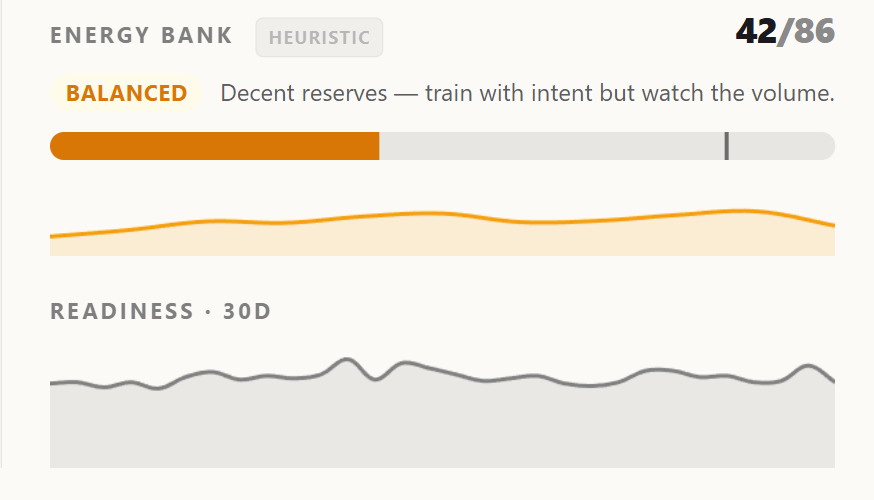

In Part 4 the audit invalidated the readiness formula and surfaced a parallel finding: EnergyBank v1 was wrong-signed against next-day HRV[^hrv] (r=−0.149) and next-day RHR[^rhr] (r=+0.212) over 387 paired days.

Wrong-signed is a strong claim. It means the concept is intact but the target is mis-specified: what v1 was measuring was probably *productive strain*, not *recovery deficit*. The two correlate on many days and diverge precisely on the days that matter, like a quiet but anxious day, an illness, a watch off the wrist.

This part is about the redesign that came out of that finding. The technical center is small: a state machine, a contraction mapping, and a set of trust states. The interesting part is what each of those exists to prevent.

## The moment that triggered the redesign

The first concrete artefact was a screenshot of my own dashboard. On the morning of 2026-05-12 the hero block showed a bar at 59% and, directly underneath it, the text "Only 25% of capacity left after today's load, keep intensity light." The two numbers did not match because they came from two different formulas. The bar was already on v2, the text was still on v1.

This was a half-cutover state that I had deliberately shipped. v2 numbers and v2 sparkline rendered in the hero; v1 verdict thresholds (`rest` / `active_recovery` / `moderate` / `push_hard`) and the text that explained them stayed live because v1 thresholds had real production calibration and v2 thresholds did not yet. The plan was to let v2 accumulate seven days of distribution and recalibrate.

Five days in, I checked the underlying numbers:

| date | v2 morning capacity | v2 EOD bank | v1 capacity | v1 verdict |
|---|---|---|---|---|
| 05-08 | 37 (bootstrap) | 27 | 83 | rest |
| 05-09 | 77 | 36 | 92 | rest |
| 05-10 | 80 | 48 | 94 | rest |
| 05-11 | 79 | 31 | 85 | rest |
| 05-12 | 80 | 59 | 83 | rest |

The v1 verdict was `rest` every single day, because v1's `current = readiness − allostatic_drain` produced ≤25 essentially every day for someone with moderately active habits. The formula's recommendation was identical regardless of input. v2 morning capacity ranged 37–80; v2 EOD bank ranged 27–59. There was actual signal in the v2 column. The v1 column was saying "rest" the way a broken clock is right twice a day.

The half-cutover plan had implicitly assumed v1 was a valid baseline I would calibrate v2 *against*. The data said v1 was degenerate. The wait-for-seven-days plan changed to *backfill v2 over historical data and let history calibrate the thresholds*. Roughly 630 EOD points across 2024-07 → 2026-05, enough to set bands honestly.

That backfill became `cmd/energy_backfill`. It also became the moment the cross-tenant story started, because once v2 had to work on retrospective data, "it works on my own laptop" stopped being good enough.

## What v1 was doing

`internal/health/energy.go` (the v1 file, still in the repo) computes a daily snapshot:

```text
drain   = strain · (1 + 0.5 · stress / 100)
restore = sleep_quality_units
bank    = clamp(restore − drain, 0, 100)
```

Stress is a *multiplier* on strain. A day with low active calories scaled by any stress factor stays small. A quiet, sedentary, autonomically taxing day, like the one when I walked the dog as usual but he had an allergy episode and I spent the whole day worrying about him, produces near-zero drain because the multiplier is multiplying a near-zero base. The bank does not move. The chart says "fresh", the body disagrees.

The other v1 problem was structural: the bank resets every day. Yesterday's residual does not carry into today. A three-night stretch of poor sleep does not progressively pull the morning starting point down; each day is an independent snapshot. That is wrong for a thing meant to capture sustained recovery.

The audit numbers made the methodological problem concrete. r=−0.149 against next-morning HRV is not a "weak signal in the expected direction". It is a signal pointing the wrong way. The formula was capturing something real, but the thing it captured (high-activity productive days drain more) does not predict autonomic recovery (which depends on a different set of factors).

## The redesign in one equation

EnergyBank v2 is a state machine:

```text
bank[t] = bank[t−1] + restore(t−1 → t) − drain(t−1 → t)
```

Same idea as Garmin Body Battery, with two opinions about how to do it:

1. **No daily reset.** The bank carries across days. A bad night drags the morning starting point down. A good night refills toward a ceiling but never pins at it.
2. **Drain is additive, not multiplicative.** `drain(Δt) = α · active_energy_kcal + β · sustained_hr_load`. Calories alone cover most days. The `β · sustained_hr_load` term captures stressful sedentary days that calories miss. It ships at `β = 0` and only goes non-zero per-user once a validation rubric passes (Part 6 territory).

Three properties fall out of the asymptotic restore that mattered enough to design around:

**Multi-night sleep deficit accumulates.** Restore is `capacity_today = bank_yesterday + (100 − bank_yesterday) · sleep_quality`. The closer to full, the smaller the dose. A single bad night (5.4h, Apr 9 in the validation dataset) keeps the bank capped at 73/100 the next morning even after a normal 7.1h sleep that follows.

**Capacity never pins at the ceiling.** Across 31 simulated days the additive variant pinned at 100 on 28 of them. The asymptotic variant pinned zero times. The bank's lower tail also gains real spread (p10 of 17 vs 35 in the additive shape), so the chart actually contains information.

**`structure_factor` only penalises, never rewards.** The asymptote provides the upper bound. Bonus weights would just chase a ceiling that already exists. The factor stays in `[0.5, 1.0]`.

## The bootstrap problem and the contraction mapping

A stateful formula has a cold-start question: where does the bank start when there is no yesterday?

The boring answer is to persist a seed. Boring answers in this kind of system tend to become long-term liabilities. Every formula version bump, every migration, every "we changed how sleep_quality is computed" becomes a conversation about which seed migrates how.

The asymptotic restore turns out to be a contraction mapping[^contraction-mapping]. Any seed is exponentially forgotten through the `(100 − bank) · sleep_quality` factor. Empirically, on real data, three seeds {10, 50, 90} converge to within **0.005 by day 7** and become bit-identical by day 9.

That means no seed state needs to be persisted at all. Every recompute walks forward through the last 14 days from a hard-coded `bank = 50`:

```text
function compute_today_bank():
    bank = 50.0
    for day in metric_points.last_14_days:
        sq = sleep_quality(day.sleep_metrics)
        bank = (bank + (100 - bank) * sq) - drain(day.activity_metrics)
    return bank
```

By the time iteration reaches "today", the seed is mathematically gone. 14 days is roughly double the convergence window.



```go
// Pure iteration: 21 days of daily inputs in, today's bank out.
// Extracted so unit tests exercise imputation and trust-state
// logic without a database.
func computeBankFromDays(days []dailyInputs, cfg EnergyConfig) BankResult {
    if len(days) != energyWindowDays {
        return BankResult{State: "stale", FormulaVersion: cfg.FormulaVersion}
    }

    bank := 50.0 // contraction-mapping seed; forgotten by day 9

    for i := 0; i < energyWindowDays; i++ {
        sq, sqImputed := sleepQualityOrTrailingAvg(days, i)
        drain, drainImputed := drainOrTrailingAvg(days, i, cfg)
        // ... imputation flag bookkeeping omitted ...
        bank = (bank + (100.0-bank)*sq) - drain
        bank = clamp(bank, -50.0, 100.0)
    }
    return BankResult{
        Bank:           int(math.Round(bank)),
        FormulaVersion: cfg.FormulaVersion,
        // ... flags, state derived from imputation count ...
    }
}
```

The real version (with the per-day nil-checking, two-pass imputation and trust-state derivation) lives in `internal/storage/energy_compute.go`. This is its readable shape.



A single mechanism handles every edge case that would otherwise need explicit code paths:

| Scenario | Behaviour |
|---|---|
| New user post-warmup | Forward-iterate from seed=50; the 14-day-ago seed dies before today renders |
| Existing user at v2 launch | Same, no migration path needed |
| `formula_version` bump | Re-iterate 14 days under the new formula; dashboard transitions smoothly within a week |
| Data gap under 14 days | Self-heals: missing days contribute `sq=0, drain=0`, bank decays toward 0, first fresh night refills asymptotically |
| Data gap over 14 days | Triggers staleness re-entry to `warmup`, no bank rendered until fresh |

This is the kind of design that looks obvious in retrospect and is the result of trying three other shapes first. Earlier drafts had a persisted seed with an "EMA warmup state machine" that needed its own migration code for every formula bump. The convergence property eliminated all of it.

There is also a tempting optimisation that did **not** get adopted. During design review, one suggestion was to cache the previous day's EOD bank in the database and start each day's iteration from that cached value rather than walking forward from `seed = 50` over 14 days. On paper this saves ~13 days of computation per recompute. In practice it would tow last week's floating-point arithmetic and last week's formula version forward through time, and any silent error in those would compound forever. The convergence-from-seed property is what guarantees that each recompute is *idempotent over source data*: drift cannot accumulate because there is nothing for it to accumulate into. The expensive-looking iteration is the cheap-looking-in-the-long-run choice. The real performance optimisation that did land is different: the recompute window is bounded to the last 24 hours per ingest event, not the full history.

## The cross-tenant test that broke v2

The first version of v2 worked on my own data and survived a backfill. It collapsed within 24 hours of running against a second tenant.

The setup matters. The project is self-hostable and a real other person was running it: my wife's account on the same server, with her own Apple Watch, her own RingConn, her own pattern of wearing them. By this point the system already had one piece of evidence that it would meet other users in unexpected ways. Part 2 covers [PR #17 from makvitaly](https://github.com/Dzarlax-AI/health_dashboard/pull/17), an external contributor adding a workouts endpoint. The second tenant was a different kind of evidence: not "someone else wants to send data the way I do," but "someone else's daily reality looks nothing like mine."

The tenant was the same code with a different person and a different watch wearing pattern. Sleep data was missing on 21 of 90 days. About 23% gap rate. Watch on the charger, sync skipped, normal life: a phone left at home, a charger forgotten on a trip, a few nights without the ring. The first version of the formula applied `sq=0` (no restore) on those days but kept drain active, integrating into a runaway negative signed bank. The internal value reached **−54**.

All five of that tenant's "worst days" in the dashboard were data gaps, not real depletion. The system was telling someone they were exhausted because they had not worn their watch. I happened to have her phone for a few hours: she had asked me to look at why the dashboard kept telling her to rest. Looking at the row I had written one afternoon and now had to explain to a real person was qualitatively different from looking at the same row on my own account.

This was the moment the design got two pieces it did not originally have. Both came from looking at a misbehaving production-shaped run for a real second user, not from theory.

**Trailing-average imputation with a hard ban on feedback.** When sleep metrics are missing for a day, `sq[d]` falls back to the average sleep quality over the last 7 days of valid, **non-imputed** data. Same for activity. The imputed days are flagged (`imputed_sleep`, `imputed_activity`) but more importantly they are **excluded from subsequent days' trailing windows.** If you let imputed values feed into the next day's average, the gap quietly drifts the formula toward whatever the gap looked like, not toward the user's actual baseline.

If fewer than 3 valid (non-imputed) days exist in the lookback window, the fallback is the user's all-time median, and the state escalates.

**Three graduated trust states.** "Imputed or not" is a binary that hides what the user needs to know. The bank degrades through three states with explicit triggers and explicit UI:

| State | Trigger | Render | AI usage |
|---|---|---|---|
| `fresh` | ≤1 imputed day in last 7 | Bank normal, no flag | Used in recommendations |
| `estimated` | 2–4 consecutive imputed days OR 2–4 imputed in 14-day window | Dotted line + "estimated · sensor data missing" badge | Used with hedge: "based on 7d pattern, not direct measurement" |
| `stale` | ≥5 consecutive imputed days OR >7 in 14-day window | Bank NOT rendered; "No recent data · check watch sync" | AI pivots from activity advice to "sync your watch" |


*The EnergyBank v2 hero. The sparkline shows the bank carrying across days; the badge under the number, if visible, is the trust state: fresh / estimated / stale.*

Two parallel triggers, `consecutive` and `proportion`, catch two different failure modes: a clean stretch of bad sync vs scattered gaps that accumulate. The cross-user data showed 23% scattered gaps; a `consecutive` rule alone would have missed it.

Recovery from `stale` is not instant `fresh`. When data resumes, the bank enters a 3-day `recovering` state where it is re-bootstrapped from `seed=50` over the last 14 days, ignoring frozen pre-stale snapshots. Five-plus days without data could mean illness, travel, burnout or a dead watch. Applying state from before the gap is the kind of silent assumption that turns a small bug into a wrong story about the user's body.

There is also a signed floor at `−50`. The original draft clamped only above. The cross-tenant run made the symmetric floor necessary; below −50 the signal saturates and further integration is noise.

## Storage that does not lie about formula versions

`energy_snapshots` looks small in the schema:

```sql
CREATE TABLE energy_snapshots (
  ts_bucket       TIMESTAMPTZ NOT NULL,
  date            TEXT NOT NULL,
  bank            INTEGER NOT NULL,
  drain_delta     INTEGER NOT NULL,
  restore_delta   INTEGER NOT NULL,
  formula_version INTEGER NOT NULL,
  components      JSONB,
  flags           TEXT[] NOT NULL DEFAULT '{}',
  computed_at     TIMESTAMPTZ NOT NULL DEFAULT NOW(),
  PRIMARY KEY (ts_bucket)
);
```

Three details earn their inclusion. None is clever; each prevents a specific kind of silent breakage.

**`date` is computed in Go, not generated by Postgres.** A `GENERATED`[^pg-generated] column expression must be `IMMUTABLE`[^pg-immutable], which forces a hardcoded timezone in DDL. That is wrong for a per-tenant multi-tenant system. The tenant's TZ comes from `REPORT_TZ`; the date is computed at write time:

```go
loc, _ := time.LoadLocation(tenantTZ)
dateStr := tsBucket.In(loc).Format("2006-01-02")
```

A snapshot written in Belgrade carries `date = '2026-05-08'` even if the user later moves to NYC. Future snapshots use the new TZ when the setting changes. Past data stays as it was, which is correct, because *it was* that day in the user's then-current timezone.

**`components` and `flags` are separate columns, deliberately.** `components` is the audit trail of the formula's inputs (JSONB[^pg-jsonb]). The HR averages, the RHR baseline used, the kcal, the sleep stage breakdown. Read-mostly. "What did the formula see?" `flags TEXT[]` is state metadata: imputation status, trust level, calibration markers. Mixing them means a flag-rendering change could mutate the audit trail. The GIN index[^pg-gin] on `flags` makes membership queries (`WHERE 'imputed_sleep' = ANY(flags)`) cheap.

**`formula_version` is per-row, never overwritten across versions.** Backfilled rows from a v2.0 run stay v2.0 even after v2.2 ships. The chart reads the latest version per date. Week-over-week comparisons stay valid within a formula version, and the UI surfaces calibration-change boundaries explicitly. This rule turns "rerunning backfill changed last week's numbers" from a recurring bug into a deliberate decision.

## What v2.5 lets the formula adapt to

The same cross-tenant run that surfaced the data-gap collapse also surfaced a calibration question. A static `α` for all users is the right base instrument but the wrong long-term answer. An athlete with low RHR and high active kcal genuinely has a different energy economy than a sedentary user. Some users will need `α` scaled.

The naive way to do that is to adjust `α` based on how well the bank tracks itself. That is the classic overfitting trap: tuning the formula against its own predictions. You need an external signal the formula does not see.

The signal v2.5 uses is **next-morning HRV**. Pearson r between today's `bank_eod` and tomorrow's overnight HRV, computed over a 30-day rolling window:

```text
if r < 0.2:    formula does not explain this user, alert, do NOT auto-tune
elif r < 0.3:  narrow tune: alpha_factor ∈ [0.8, 1.2]
elif r < 0.5:  full tune: alpha_factor ∈ [0.5, 1.5]
else:          strong: alpha_factor ∈ [0.4, 1.7] (rare)
```

Two guard rails matter here. The narrow tune band is critical: on a 90-day prototype run, the unconstrained optimum landed at the search boundary (factor=0.5) for a marginal r-improvement. That is a textbook edge-solution sign of misspecification, not personalisation. Clamping to [0.8, 1.2] in the marginal-r zone prevents a small statistical signal from causing a large formula shift.

And if `r < 0` (low bank correlates with *high* HRV, the opposite of what the formula claims) auto-tune is suppressed entirely and the case escalates to a calibration review. Chasing a wrong-direction correlation is how a system trained on its own predictions ends up further from physiology than it started.

The original v2.5 design also planned to use next-day RHR as a second signal. The same 90-day prototype run showed RHR sign-flips physiologically: vagal rebound after high load means *lower* next-morning RHR, not higher. RHR was dropped from the personalisation signal. HRV alone is the cleaner residual.

## The phased delivery and what it leaves out

The plan ships in stages with explicit gates:

- **v2.0**: skeleton. Schema, event-driven recompute, sleep-only restore, hourly chart in dashboard hero. `β = 0`. Constants hard-coded; calibration deferred. Old v1 stays live until v2.0 is validated.
- **v2.1**: calibration. Run for 7+ days, tune `α` against the personal bank histogram, re-derive verdict thresholds from new distribution percentiles.
- **v2.2**: the autonomic-load drain term goes non-zero per user, gated by the validation rubric in Part 6.
- **v2.3**: daytime restore + day-tagging UI (`alcohol`, `caffeine_high`, `illness_confirmed`, `travel`, `menstrual`). Tags do not modify drain; they reshape the verdict narrative.
- **v2.4**: actionable hooks. Gating real behaviour like workout-type suggestion in morning report, calendar slot blocking.
- **v2.5**: per-user `α` personalisation via the HRV-residual rubric.
- **v3.0**: profile presets (`athlete` / `sedentary` / `recovery-impaired`) that adjust both `α` and `structure_factor` together.

The hard call in v2.5 is "transparency over override". The dashboard surfaces "calibrated automatically · `α_factor=0.85` · last update Mon 5 May", and `/admin` has a "reset to default" button for debugging. There is no user-facing knob. A measurement instrument should not, by default, expose a "make my number look better" control.

## The actual lesson

EnergyBank v1 was the right shape for a first attempt and the wrong shape for production. v2 is small in terms of code: a forward iteration, an asymptotic update rule, a coarse state machine for trust. Each line of it exists because the prior shape produced a story that the data did not support.

The previous article was about trusting the target. This one is about trusting the formula's silence. Knowing when the bank should not be rendered at all because the sensors are not feeding it, instead of producing a confident-looking number from inputs that were not there.

The next article picks up the open question this one leaves on the table: what `sustained_hr_load` is, why a raw `HR − RHR` integral turned out to be the wrong shape, and how the validation rubric stops the formula from auto-tuning itself into nonsense.

[^contraction-mapping]: A mathematical property of iterated functions where each iteration brings the value closer to a unique fixed point, regardless of where you started. The classic example: if `x_new = (x + 100/x)/2`, repeated application from any positive starting value converges to √100 = 10. Here it means that whatever bank value you seed the iteration with, the answer after enough days is the same. The seed gets exponentially forgotten.
[^hrv]: Heart rate variability. The millisecond-level fluctuation in intervals between consecutive heartbeats. More variability is better: it indicates parasympathetic recovery rather than sympathetic dominance.
[^rhr]: Resting heart rate. Heart rate measured during rest, ideally during the last hours of overnight sleep. Trending upward over days is a classic illness or overload signal.
[^pg-generated]: A Postgres column whose value is computed from an expression rather than written by the application. Always reflects the latest expression evaluation; can be `STORED` (materialised on insert) or `VIRTUAL` (computed at read time, Postgres 17+).
[^pg-immutable]: A Postgres function-volatility marker meaning "given the same inputs, always returns the same output, and has no side effects." Required for expressions used inside generated columns or expression indexes, because Postgres caches their values aggressively. Functions like `now()` or `current_setting()` are not `IMMUTABLE` precisely because they read external state.
[^pg-jsonb]: Postgres's binary JSON storage type. Like `JSON` but parsed into a tree structure on insert (slower writes, much faster reads), supports indexing on individual keys and array members, and rejects malformed JSON at write time.
[^pg-gin]: Generalized inverted index. A Postgres index type optimised for "this value is one of many inside this row" queries. The classic use case is array membership (`'foo' = ANY(my_text_array)`) and full-text search; the index entry points from a single token to all rows that contain it.
