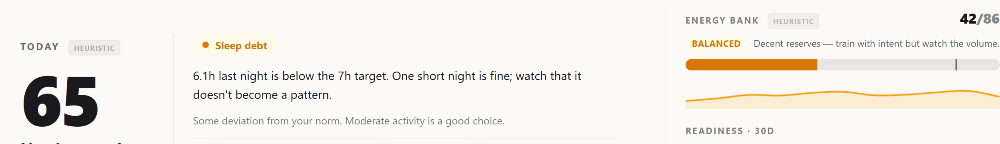

The first six parts of this series were about the server learning to have opinions. Ingestion gates, source identity, sub-score eligibility, formula-version boundaries, validation rubrics: every piece earned its right to a number. Once that work was done, a new question opened on the other side of the wire. What is the iOS client allowed to do with those numbers?

The answer turned out to be narrower than I expected when I started. The interesting part of building the mobile app was not what got added to it. It was what got *removed* from it, repeatedly, as the server learned to do each thing better.

This part is the build log of that subtraction.

## What the app was at first

The very first commits of `health-sync` did not produce anything resembling a dashboard. The initial UI was three views: a Settings tab for the server URL and API key, a Status tab showing "Last sync: 2 min ago / Failed (3 retries)", and a TabView to switch between them.

```text
0db7c78 feat: initial UI — DesignSystem, SettingsView, StatusView, TabView
```

That was it. The app was a transmitter. Tap "Sync Now", or wait for an `HKObserverQuery` wakeup, watch the status row update. To actually look at sleep stages or readiness history, I opened `health.dzarlax.dev` in Safari and read the web dashboard.

This was a deliberately small surface. Part 2 covers the ingestion side in detail. At that point the open questions were "do per-segment sleep records survive the new pipeline?" and "do `HKQueryAnchor`[^hkqueryanchor] resets after every fail not duplicate data?", not "what should an Activity tab look like?". Building a UI for data I was still learning to trust would have been premature.

It also meant I had to make a real decision before adding more screens: was the iOS app going to be a viewer at all, or was Safari fine forever?

## The decision: native viewer, not "open Safari"

The honest argument for "just use the web dashboard" is that it works, the server already speaks JSON, and Safari is competent. Most of the time that argument wins.

The reasons it did not win here, in order of how much they actually mattered:

1. **Offline-friendly read.** The web dashboard requires a round-trip on every page load. A native app can cache the last `/api/health-briefing` response and render it instantly when I tap the icon at 06:50 with one bar of signal. The same applies on planes and in places where my SIM is roaming and HTTPS to the home server is intermittent.
2. **Tactile parity with the rest of HealthKit.** On iOS, health data lives in apps with native charts, swipe gestures, system-level sharing. A web page in Safari does not feel like part of that ecosystem. This is mostly aesthetic, but aesthetic matters on the device you check every morning.
3. **Widgets and lock-screen surfaces.** "Last sync · 142 pts" on the lock screen is only possible through a real app target. Same for App Intents[^app-intents] (`SyncNowIntent` for Shortcuts / Siri).
4. **Background sync.** The `BGProcessingTask`[^bg-task] path needs a native app target anyway, for ingestion reasons unrelated to display. Once that target exists, not rendering anything in it felt like waste.

The commit where the app stopped being a pure transmitter and became a viewer is one line in the git log:

```text
b9f538e feat: native read-only dashboard, en/ru/sr localization
```

Five tabs landed in that PR: Today, Sleep, Trends, Metrics, Settings. The choice of names is server-aligned. Those are the same sections the web dashboard renders, with the same JSON endpoints behind them.

## The rule that made the rest of the work easy

When you build a second client over an API you also own, the gravity is always toward duplicating server logic. You have the data in hand on the device, you can see the chart shape, you know what colour the "good readiness" status is. It is a few lines of Swift to add a `readinessColor(for: Int)` helper that lives next to the view.

I did not write that helper. I wrote a server response field instead:

```json
{
  "readiness_today": 78,
  "readiness_status": "good",
  "readiness_color_token": "ds.semantic.positive"
}
```

The rule that made every subsequent decision easy: **no business logic on the client.** No readiness scoring. No aggregation. No source priority. No sleep dedup. No "if value > 70 show green". No translation tables for metric display names. No interpretation of any kind that the server is already capable of doing.

The client does four things:

- Renders charts and lists from server JSON.
- Handles navigation between screens.
- Manages local-only concerns: server URL, API key in Keychain, sync history (last 50), retry queue for failed payloads.
- Talks to HealthKit on the ingestion side (Part 2's territory, a separate role kept architecturally distinct).

Everything else, every interpretive layer, every formatting rule that could theoretically vary by tenant or formula version, lives on the server. When new metrics or copy ship, no app update is needed.

This rule sounds austere on paper. In practice it removed entire categories of bugs from the project. The web dashboard and the iOS app cannot drift from each other on what "good readiness" means, because neither of them is the source of that definition.

## `ServerClient` is a `@MainActor final class`, not an `actor`

The first non-trivial Swift 6 wall I hit was the type of `ServerClient`. Reflexively I wrote it as an `actor`[^swift-actor]. Concurrent network requests, async/await everywhere, looked like an obvious fit. Then nothing compiled.

The project builds with Swift 6 strict concurrency (`-strict-concurrency=complete`). The default actor isolation for the project is `MainActor`. That means every `Decodable`[^decodable] conformance generated by the compiler is `@MainActor`-isolated. An `actor ServerClient` is its own actor, not MainActor, so it cannot call those conformances or access MainActor-isolated state like `KeychainStore.apiKey`[^keychain]. Every call site needed an `await` and a hop, and the compiler refused half of them as cross-actor violations.

The fix was to make `ServerClient` a `@MainActor final class`. Counter-intuitive at first ("but isn't main thread for UI only?") until you remember that `URLSession.data()` releases the main actor while awaiting the network. Concurrent network overlap is preserved automatically; the main thread is only held during JSON decoding and result delivery, both of which are fast.



```swift
/// MainActor-isolated because the project's default actor isolation
/// is MainActor, which means every Decodable conformance synthesised
/// by the compiler is also MainActor-isolated. URLSession.data
/// releases the main actor while awaiting the network round-trip,
/// so concurrent requests still overlap on the wire.
@MainActor
final class ServerClient {
    static let shared = ServerClient()

    private let session: URLSession
    private let decoder: JSONDecoder
    private var cachedLang: String?

    init() {
        let config = URLSessionConfiguration.default
        config.httpAdditionalHeaders = ["Accept": "application/json"]
        self.session = URLSession(configuration: config,
                                  delegate: NoRedirectDelegate(),
                                  delegateQueue: nil)
        self.decoder = JSONDecoder()
    }
    // ... fetchDashboard, fetchBriefing, postHealth, etc.
}
```

Nothing here is unusual except the `@MainActor` at the top. The surprise was discovering that the natural choice is the right one once you stop fighting the compiler.



This is documented in the `CLAUDE.md` for the iOS app, because it is the kind of decision that an outside contributor (or future-me) would otherwise re-litigate every six months.

## Two-layer localization, and why the layers are allowed to disagree

The app speaks three languages: English, Russian, Serbian. So does the web dashboard. So does the Telegram report. The architectural question was: who owns each language string?

The split that landed:

- **UI chrome** (tab labels, section titles, buttons, error banners, settings rows) is localized on the client via a String Catalog[^xcstrings] (`Localizable.xcstrings`). Follows iOS locale. iOS provides a per-app language toggle in Settings → Health Sync (enabled via `UIPrefersShowingLanguageSettings`).
- **Server-side content** (briefing text, alert wording, section names, metric labels, AI insight text) is localized **on the server**. The iOS app passes `?lang=…` and the server returns ready-to-render strings. The lang value comes from the user's `report_lang` setting on the server (`/api/settings`), not from the device locale.

The two layers can disagree. If I set `report_lang=sr` on the web and my phone is in Russian, the iOS UI is Russian and the briefing content is Serbian. This is not a bug. It is intentional.

The reason is that "briefing language" and "device language" answer different questions. The device language is "what language is comfortable for me to navigate an app in". The briefing language is "what language is comfortable for me to read my own health data in". That one is set once on the server, follows me across the web dashboard, the iOS app, and the Telegram bot, and changes only when I explicitly decide to change my health-data language.

Conflating the two would mean either the briefing language follows the phone's locale (so I cannot read English health text on a Russian-set phone without a settings dance), or the phone's locale follows the briefing setting (which is wrong because the OS chrome should match the user's general device preference). Splitting them costs one paragraph in the SPEC and earns the right to never explain it again.

The deeper payoff is that the server's `internal/health/i18n_*.go` catalogues are the single source of truth for content strings. When a new metric ships with a new display name, no app update is needed. The catalogue updates, the API returns the new strings, the next pull-to-refresh shows them.

## The refactor arc: three times I caught the client computing

The "no business logic on the client" rule was not a decree I followed perfectly. It was a discipline I had to re-establish three times, each time after catching a piece of business logic that had silently grown on the device.

### `AIInsightParser` (PR #12)

The AI briefing text on the morning report originally arrived as a single Markdown blob. Gemini-generated prose with informal section markers ("**Sleep:** ...", "**Yesterday:** ..."). The iOS app needed to render each section under its own collapsible header on the Today tab.

So I wrote `AIInsightParser`. It tokenised the blob, split on the section markers, normalised whitespace, recovered from malformed Markdown if Gemini got creative. It worked. It also had to be updated every time the AI prompt changed even slightly, because the section markers were not part of a stable contract. They were just whatever Gemini happened to emit on a given prompt revision.

The right fix was on the server, not on the client. Part 1 sketched it briefly: the AI briefing is generated and stored *per block* in `ai_briefing_blocks`. SLEEP, YESTERDAY, RECOVERY, RECOMMENDATION as separate rows keyed by `(date, lang, block)`, cached by input-hash so a late HRV sample only invalidates the blocks that depended on it. Once that storage shape existed, the API could return structured blocks directly:

```json
{
  "blocks": {
    "sleep": "...",
    "yesterday": "...",
    "recovery": "...",
    "recommendation": "..."
  }
}
```

No parsing needed. PR #12 (`refactor(today): consume server-localized labels, delete AIInsightParser`) removed the parser entirely. The client now reads `blocks.sleep` and renders it. If Gemini reformats its output tomorrow, the server's per-block storage absorbs the change; the iOS app does not have to know.

The parser had been ~150 lines of Swift that existed only because the server's contract was not yet structured enough. Deleting it felt like a small refactor. It was actually the moment the client conceded that interpreting AI text is not its job.

### Hardcoded section list (PR #13)

The Trends tab originally rendered a hardcoded list of three sub-sections: Cardio, Activity, Recovery. Those were the three categories the web dashboard had on the day I copied the layout. I typed them as a Swift array. Tap row → push `CardioDetailView` / `ActivityDetailView` / `RecoveryDetailView`.

A few weeks later the web dashboard grew a fourth section (Readiness). The iOS Trends tab did not. The client did not know about it because the section list was a constant in code, not a value read from the server.

The fix was already half-built: `/api/health-briefing` returns a `sections` array with each entry carrying `key`, `display_name`, `summary`, `status`, `deltas`. The web dashboard renders that array dynamically. The iOS Trends tab needed to do the same.

PR #13 (`feat(trends): server-driven section list, drop hardcoded Cardio/Activity/Recovery`) deleted the hardcoded array and the three view-routing branches. The Trends tab now iterates over `sections` and pushes a generic `SectionDetailView` parameterised by the section's `key`. When a new section ships on the server, the iOS app sees it on the next refresh.

This kind of bug is easy to miss because it does not crash anything. The iOS app keeps showing three rows; the user sees three rows; nothing visibly wrong. The drift only surfaces when someone happens to compare web and mobile side-by-side. By that point the apps have been silently inconsistent for an unknown number of weeks.

### Render server labels verbatim (PR #12 again, plus follow-ups)

A subtler version of the same problem: the iOS app had its own translations of metric display names. "Heart Rate", "Сердечный ритм", "Frekvencija srca". Maintained in `Localizable.xcstrings`. The server *also* had translations of the same names, in `internal/ui/i18n_{en,ru,sr}.go`. Two sources of truth for the same strings.

For a while they agreed. Then the server gained a new locale-specific phrasing of "Resting Heart Rate" in Serbian, and the iOS app did not. Same drift shape as the section list. Invisible from any single screen, only visible when comparing across surfaces.

The fix is in PR #12 and the follow-up `30da2b2 fix(today): render server labels verbatim`: every metric label, every section title, every status word that the server can produce is rendered as-received. The iOS String Catalog kept its entries only for things the server does not know about (the literal words on Settings buttons, error banners for network failures, accessibility labels that need to follow iOS conventions).

The boundary moved a step inward. The client's `Localizable.xcstrings` shrunk. Nothing new was added to it; some existing entries were removed.

## The boundary going one step further: methodology status

A later refactor (PR #118 on the server) extended the same principle to a place I had not initially thought to look: the trust level of each computed score.

The web dashboard hero now renders small badges next to each score, four words each: *heuristic, personalized*, or *validated floor, candidate*, or *experimental, not production*. The badge classes are: `heuristic_personalized` (current Readiness v1, which is a tuned expert formula on personal baselines), `heuristic_prescriptive` (current EnergyBank v1 in its half-cutover state), `validated_floor_candidate` (the EWMA45 layer that Part 4 verified on naive baselines), `experimental_formula` (EnergyBank v2 in production but pre-calibration), and `labeling_framework_ready` / `experimental_not_production` for the sub-scores that have writers but are not surfaced as numbers yet.

The point of the badges is not visual polish. It is that the methodology status of every score is now **part of what the server tells the client to render**. A reader of the dashboard can tell at a glance whether a number is an expert heuristic on personal data, a validated floor, or an experimental layer. Same with the iOS app once these get wired in: it will render the badge alongside the score, and the badge text comes from the server's i18n catalogue, the badge class comes from the server's methodology table.

This is the natural conclusion of the refactor arc. AIInsightParser deletion moved the *content* of the AI insight to the server. Section-list de-hardcoding moved the *list of dimensions* to the server. Label rendering verbatim moved the *display strings* to the server. Methodology badges move the *trust level of each score* to the server. At each step the client got smaller and the server got more honest about what it was telling the client to show.


*Each score now carries its own methodology badge ("heuristic, personalized" / "experimental, formula" / "validated floor, candidate"). The badge text comes from the server's i18n catalogue; the client renders it verbatim.*

There is a structural payoff. The same dashboard page can now display, side by side, a Readiness number tagged "heuristic, personalized" and a Recovery Stability number tagged "validated floor, candidate." Without the badge the two numbers would look indistinguishable. With it, a reader can ask "which of these has methodological backing and which is a useful tuned guess?" and get an honest answer from the same JSON payload that produced the numbers.

## What stays on the client, and what is missing on purpose

The four bullets I wrote earlier are the whole list of client responsibilities, but two of them deserve a second pass.

**Local-only state.** The Keychain[^keychain] holds the API key. SwiftData[^swiftdata] holds the server URL, sync history (last 50 entries), per-metric `HKQueryAnchor`, and the retry queue for failed payloads. All of these are about *this device's* relationship to the server, not about *the user's health data*. None of them ever round-trip. If I sign in on a second device, both maintain their own state; the only shared truth is what lives on the server.

**Pull-to-refresh and error handling.** When the network is down, the app shows the last-cached briefing with a small "last refreshed N minutes ago" subtitle. It does not invent values. It does not pretend a stale number is fresh. It does not extrapolate from older data to fill the gap, and that matters. Part 5 spent a long time on the discipline of admitting when sensor data is missing; the client extends the same discipline to "the server is not reachable right now".

**HealthKit cross-check is deliberately missing.** The native client *could* query HealthKit on the device, compare what HealthKit currently knows about today's HRV/RHR/sleep against what the server has, and surface "the server is missing data". It is one of those features that sounds obviously useful and is in the SPEC as out-of-scope for v1.

The reason is not capacity. It is role. Today the device is the *producer* (Part 2) and the *viewer* (this article). Those are two roles, but they are non-overlapping in a clear way: the producer side writes to `/health`, the viewer side reads from `/api/*`. Adding HealthKit cross-check would make the device an *auditor* of the server, a third role with different failure modes, different state to manage, and different opportunities to drift from the server's authoritative view. I want each role to be solid before the next one lands. Not all at once.

## The actual lesson

The temptation when building a second client is to give it the same opinions the first client has. The reasoning is reasonable: the data is the same, the user is the same, the desired behaviour is the same. So a little client-side logic is fine, right?

Each time I gave in, it cost a refactor later: parse-and-delete for the AI text, server-driven list for the sections, removed strings for the labels. None of those refactors were hard, individually. But the pattern was unmistakable. Every piece of business logic on the client was a piece of business logic that the server could not authoritatively own. Every time I shipped one, I committed myself to keeping two copies in sync.

The iOS app is now small in a way that initially looked like a missed opportunity and turned out to be the point. It transmits data into the system. It renders data out of the system. It does not interpret anything in between.

The previous article was about trusting the verdict. This one is about trusting the *boundary*. Knowing where the system's opinions are allowed to live, and refusing to let them duplicate themselves across surfaces just because the temptation is there.

There is one role the system still needs to define before the build log can really pause. So far every input has come from sensors and every output has come from formulas. Both sides are objective in a narrow sense: HealthKit reports what it measured, the server interprets what arrived. The user is in the loop only as a subject of measurement, not as a voice in the loop. The next article is about adding that voice. A one-tap morning check-in that asks how the day starts, gates the morning report on the answer, and is allowed to do exactly none of the things Part 6 said self-report should not do.

[^swift-actor]: Swift 6's primary concurrency primitive. An `actor` is a reference type whose internal state is automatically serialised (only one thread can mutate it at a time) and accessing it from outside requires `await`. The natural fit for "a thing that holds mutable state and gets called from multiple coroutines." `@MainActor` is the special actor tied to the UI main thread; types isolated to it can only be touched from main-thread code (or via `await` from elsewhere).
[^hkqueryanchor]: HealthKit's incremental-sync cursor. An opaque token returned by `HKAnchoredObjectQuery` that lets the next query fetch only samples added since the previous successful call. Stored per-metric in SwiftData so the client never re-reads old data; if a sync fails, the anchor is not advanced and the next observer wakeup retries from the same point.
[^app-intents]: Apple's framework that lets apps expose typed actions to the system: Shortcuts, Siri, Spotlight, focus modes. An intent like `SyncNowIntent` becomes a Shortcut the user can trigger from anywhere on iOS, including via voice.
[^bg-task]: Apple's API for periodically waking the app to do work without UI. The system decides when to run these based on the device's current battery level, network availability and the user's activity patterns. Required for any feature that needs to do something while the user is not actively using the app, like polling HealthKit for new sleep data overnight.
[^decodable]: Swift's standard protocol for "this type can be initialised from an external representation like JSON." The compiler can synthesise the conformance automatically for value types whose fields are all themselves `Decodable`, which makes JSON parsing in modern Swift almost zero-boilerplate.
[^keychain]: Apple's encrypted, system-level credential store. Items are tied to the device and the app's signing identity, survive app reinstalls, and are accessible only to the original app (or apps that share its keychain access group). The right place for tokens, API keys, and secrets; the wrong place for arbitrary user data.
[^xcstrings]: Apple's modern localisation format (introduced in 2023). A single JSON file holds all source strings and translations, with first-class support for plural rules and variations. Replaces the older `.strings` + `.stringsdict` pair.
[^swiftdata]: Apple's persistence framework introduced in 2023 as a Swift-native successor to Core Data. Schema-from-source-of-truth (`@Model` classes), automatic migration for simple schema changes, and tight integration with SwiftUI.
